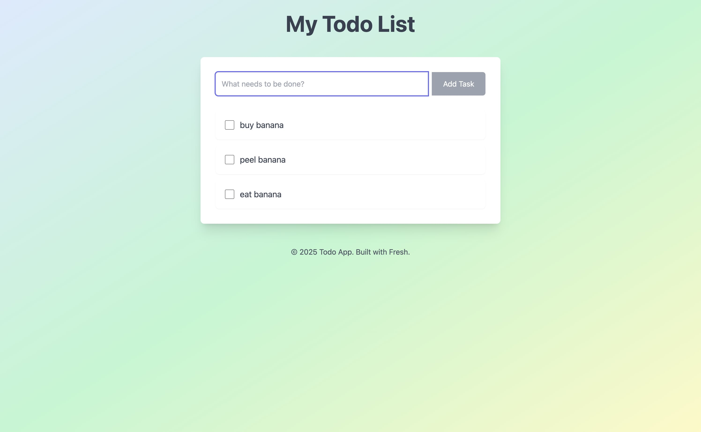

# Simple Web Stack

This project demonstrates a todo list application built with Deno Fresh and Axum.



| Component | Technology |
|---|---|
| Frontend | [Deno Fresh](https://fresh.deno.dev/) |
| Backend | [Axum](https://docs.rs/axum/latest/axum/) |
| Database | [MySQL](https://www.mysql.com/) + [sqlx](https://github.com/launchbadge/sqlx) |

## Prerequisites

- [Rust](https://www.rust-lang.org/)
- [Deno](https://deno.com/runtime)
- [Docker](https://www.docker.com/) (or [Orbstack](https://orbstack.dev/), or [Podman](https://podman.io/))
- [Docker Compose](https://docs.docker.com/compose/)

## Quick Start

This project uses Docker Compose to manage its services. The Deno tasks provide convenient wrappers for `docker compose` commands.

```bash
deno task up
```

### Deno Tasks:

Run with `deno task <task>`:

| Deno Task | Description |
|---|---|
| `up` | Builds and starts all services in detached mode (`docker compose up -d --build`). |
| `down` | Stops and removes all services (`docker compose down`). |

### Accessing Services:

*   **Frontend**: Accessible at [http://localhost:8000](http://localhost:8000) after running `deno task up`.
*   **Backend**: Accessible at [http://localhost:3000](http://localhost:3000) after running `deno task up`.
